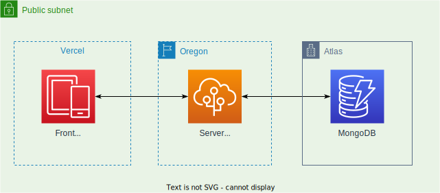

   
  
   
  

    
    
    

  

## 🗂 Table of Contents
- [🗂 Table of Contents](#-table-of-contents)
- [📑 About](#-about)
  - [🏗 Architeture](#-architeture)
- [💻 Technologies](#-technologies)
  - [🏢 Server](#-server)
  - [📲 Client](#-client)
- [🏃 RoadMap](#-roadmap)
  
  
## 📑 About
This application is the tabletop game cards against humanity. It has a server layer that contains the server that manages the game and data persistence and a client layer that contains all the user interface rules.

### 🏗 Architeture

## 💻 Technologies

### 🏢 Server

### 📲 Client

## 🏃 RoadMap
- [x] Architectural drawing
- [x] Server init
- [x] Client init
- [x] Server dependencies
- [x] MongoDB config
- [ ] Data Model
- [ ] Cards CRUD
- [ ] Socket.IO Config Runner
- [ ] Match Events
- [ ] Player Events
- [ ] Round Events
- [ ] Client dependencies
- [ ] Lobby
- [ ] Cards
- [ ] Tabletop
- [ ] Socket Client Events
- [ ] Secure API
- [ ] Deploy
  